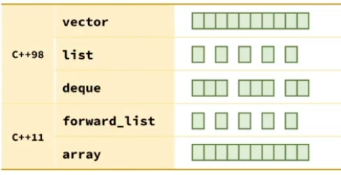
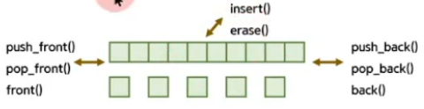
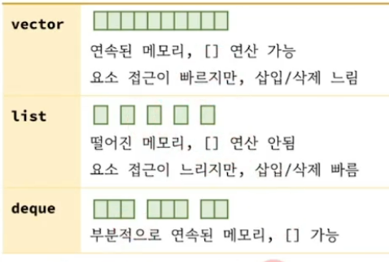

<style>
r { color: Red }
o { color: Orange }
g { color: Green }
</style>

## 선형(sequence) 컨테이너
- 모든 요소들이 삽입된 순서로 한줄로 놓여있는 것
- 5개의 선형 컨테이너 제공
- 선형 컨테이너의 메모리 구조



- deque 는 덱(deck)로 발음.
- list는 double linked list, forword_list는 single linked list

```c++
#include <vector>		
#include <list>			
#include <deque>		
#include <forward_list> 
#include <array>

int main()
{
	// 1. 선형 컨테이너(sequence container)의 메모리 구조
	std::vector v = {1, 2, 3, 4, 5};
	std::list   s = {1, 2, 3, 4, 5};
	std::deque  d = {1, 2, 3, 4, 5};

	// 2. 대부분의 멤버 함수는 이름(사용법)이 동일 합니다.
	v.push_back(2);
	s.push_back(2);
	d.push_back(2);

	// 3. 사용법이 다른 경우가 있다면 의도적인 설계 입니다.
//	v.push_front(3);	// error. vector는 전방 삽입 안됨
	s.push_front(3);
	d.push_front(3);

	v[4] = 5;
//	s[4] = 5;	// error. list 는 배열 연산 안됨.
	d[4] = 5;

	// 4. 사용법이 유사하므로 컨테이너를 변경해도 대부분의 코드는 수정 없이 사용가능
//	std::vector c = {1,2,3,4};
	std::list c = {1,2,3,4};

	c.push_back(10);
	c.pop_back();
}
```

## 대부분의 멤버함수는 이름이 동일하다.


## 사용법이 다른 것은 의도적인 설계
- vector는 push_front(), pop_front()가 없다.
  - vector의 앞에 삽입/삭제하는 것은 성능이 좋지 않다.
- list는 [] 연산을 할수없다.
  - 연속되지 않은 메모리에 [] 연산은 성능이 좋지 않다.

## 어떤 컨테이너를 사용할 것인가?

- 사용법이 유사하므로 컨테이너만 변경하면서 성능 측정 가능
- 대부분의 경우는 vector를 권장 (연속된 메모리이므로 캐쉬 적중율이 높음)
 
 