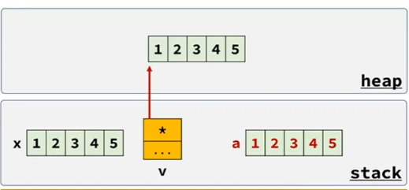

<style>
r { color: Red }
o { color: Orange }
g { color: Green }
</style>

## 배열 vs std::vector

 

 ||배열|std::vector|std::array|
 |--|--|--|--|
 |메모리 구조|연속된 메모리|연속된 메모리|연속된 메모리|
 |메모리 위치|stack|heap|stack|
 |크기 변경|X|O|X|
 |요소 추가|X|O|X|
 |멤버 함수|X|O|O|

 ```c++
#include <vector>
#include <array>	

int main()
{
	int x[5]      = {1,2,3,4,5};
	std::vector v = {1,2,3,4,5};

	x[0] = 10;
	v[0] = 10;

	std::array  a = {1,2,3,4,5};
	a[0] = 10;

	auto n = a.size(); // ok.. 멤버 함수가 있다.

	a.resize(3);		// error
	a.push_back(3);		// error
}
 ```
- `std::array`는 `std::vector` 보다 불편하지만 <r>raw array와 거의 동일한 성능을 보장한다.</r>


```c++
#include <array>

int main() {
	// C++17 부터는 초기값이 있으면 타입 인자 생략가능
	std::array arr1 = {1,2,3,4,5};


	// 초기값이 없거나 
	// C++17 이하의 환경에서는 타입인자를 전달해야 한다.
	std::array<int, 5> arr2; 		
	std::array<int, 5> arr3 = {1,2,3,4,5}; 		
}
```


