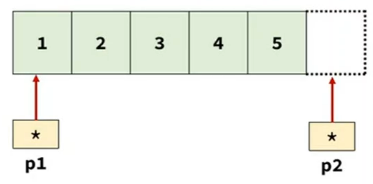
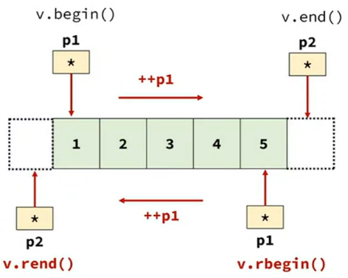

<style>
r { color: Red }
o { color: Orange }
g { color: Green }
</style>

## 배열은 연속된 메모리이므로
- 1번째 요소의 주소를 담은 포인터 변수만 있으면 <r>++, *연산으로 모든 요소에 접근</r>할수 있다.

## std::list는 연속된 메모리가 아니므로
- <r>반복자(iterator)만 있으면 ++, * 연산으로 모든 요소에 접근</r>할수 있다.
- p2 자체가 포인터는 아니지만
- 내부적으로 포인터 멤버 데이터가 있고
- operator++, operator* 연산자를 재정의해서
- 포인터처럼 동작하게 한 것

```c++
#include <print>
#include <list>
#include <vector>

int main()
{
	int x[5] = {1, 2, 3, 4, 5};	
	int* p1 = x;
	++p1;
	std::println("{}", *p1); // 2	

	std::list s = {1, 2, 3, 4, 5};
	auto p2 = s.begin();
	++p2;
	std::println("{}", *p2); // 2	

	std::vector v = {1, 2, 3, 4, 5};	
	auto p3 = v.begin();
	++p3;
	std::println("{}", *p3); // 2	
}
```

## 반복자(iterator) 디자인 패턴
- 복합 객체의 <r>내부 구조에 상관없이 동일한 방법으로 모든 요소에 접근</r>하게 한다.
- 모든 컨테이너의 요소 접근을 동일한 방법으로 수행

## STL에서의 반복자 구현 방식
- 포인터와 동일한 방법으로 사용할수 있도록 만들어져 있음.
- <r>진짜 포인터는 아니지만 포인터와 동일한 방식으로 ++, * 연산자 사용</r>

## 반복자(interator) 의 정확한 타입
- 컨테이너타입::interator
- std::list<int>::iterator p1 = c.begin()
- std::list::iterator p1 = c.begin()

## 반복자 타입 직접 사용하면
- 코드가 복잡해 보이고(가독성 나쁨)
- 컨테이너 변경 시 반복자 타입도 변경되어야 한다.
- 되도록이면 auto를 사용하자

## 반복자를 꺼내는 3가지 방식
|||
|--|--|
|c.begin()|C++98부터 사용되던 전통적인 방식|
|std::begin(c)|C++11에서 추가된 방법<br>c가 raw array라도 가능|
|std::range::begin(c)|C++20에서 추가된 방법<br>위 방식보다 좀더 안전한 코드|

```c++
#include <list>
#include <vector>
#include <ranges>

int main()
{
	// 1. 반복자의 정확한 타입
//	std::list c = {1, 2, 3, 4, 5};
//	std::vector c = {1, 2, 3, 4, 5};
	int c[5] = {1, 2, 3, 4, 5};

//	std::list::iterator p = c.begin();
//	std::list<int>::iterator p = c.begin();
//	std::vector<int>::iterator p = c.begin();
	auto p = c.begin();

	// 2. 반복자를 꺼내는 방법
	auto p2 = c.begin();	// raw array 라면 error
	auto p3 = std::begin(c);
	auto p4 = std::ranges::begin(c);
}
```

## c.end()로 꺼내는 반복자
- 컨테이너의 마지막 요소가 아닌 <r>마지막 다음 요소</r>를 가리키는 반복자
- past-the-last element
- <r>* 연산을 하면 안된다.(runtime error)</r>
- c.begin() 등의 방식으로 꺼낸 <r>반복자가 구간의 끝에 도달했는지 조사하는 용도로 사용</r>



```c++
#include <print>
#include <vector>

int main() {
	std::vector v1 = {1, 2, 3, 4, 5};

	auto p1 = v1.begin();
	auto p2 = v1.end();

	*p1 = 10;
//	*p2 = 20;	// runtime error

	while( p1 != p2 ) {
		std::println("{}", *p1);
		++p1;
	}
}	
```

## 역반복자 (reverse iterator)


- 컨테이너의 요소를 거꾸로 순회할때 사용
- 역반복자를 사용하면 <r>기존에 작성된 정방향으로 동작하는 알고리즘을 코드 수정없이 역방향으로도 동작하게 할수 있다.</r>

```c++
#include <print>
#include <vector>

int main() {
	std::vector v1 = {1, 2, 3, 4, 5};

//	auto p1 = v1.begin();
//	auto p2 = v1.end();

	auto p1 = v1.rbegin();
	auto p2 = v1.rend();

	while( p1 != p2 ) {
		std::println("{}", *p1);
		++p1;
	}
}	
```
 


