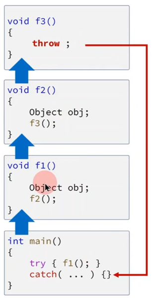

<style>
r { color: Red }
o { color: Orange }
g { color: Green }
</style>

## stack unwinding
- 예외가 발생해서 catch 로 이동할때 중간과정에서 만든 <r>stack에 있는 모든 변수(객체, 지역 변수)는 파괴된다.</r> (소멸자 호출)



```c++
#include <print>

struct Object 
{ 
	~Object() { std::println("~Object"); } 
};

void f3() 
{
	std::println("f3 start");
	throw 1;
	std::println("f3 finish");
}
void f2() 
{ 
	std::println("f2 start");
	Object obj; 
	f3();
	std::println("f2 finish");
}
void f1() 
{ 
	std::println("f1 start");
	Object obj; 
	f2();
	std::println("f1 finish");
}

int main()
{
	f1();
	try
	{
		f1();
	}
	catch( ... )
	{
	}
}
```

## RAII 
- Resource Acquisition Is Initialization
- 자원의 할당/해지를 직접하지 말고 생성자/소멸자를 사용해서 관리하는 기술

```c++
#include <print>

class mutex
{
public:
	void lock()   { std::println("mutex lock"); }
	void unlock() { std::println("mutex unlock"); }
};

mutex m;

class lock_guard
{
	mutex& mtx;

public:
	lock_guard(mutex& m): mtx(m) { mtx.lock();}
	~lock_guard() { mtx.unlock();}
};

void fn()
{
	lock_guard g(m); // m.lock()
//	m.lock();
	
	throw 1;

//	m.unlock();
}

int main()
{
	try { fn();} 
	catch(...){}
}
```