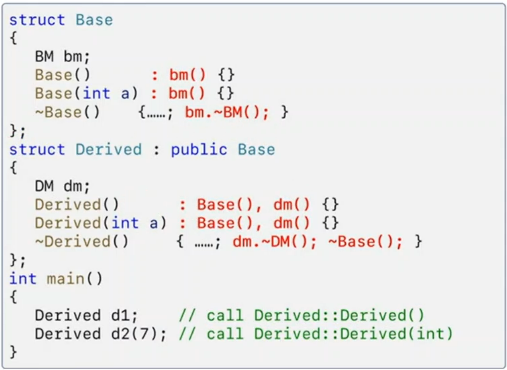

```c++
#include <iostream>

struct BM // BaseMember
{
	BM()  { std::cout << "BM()" << std::endl;}
	~BM() { std::cout << "~BM()" << std::endl;}
};
struct DM // DerivedMember
{
//	DM()     { std::cout << "DM()"    << std::endl;}
	DM(int)  { std::cout << "DM(int)" << std::endl;}
	~DM()    { std::cout << "~DM()"   << std::endl;}
};
struct Base
{
	BM bm;
//	Base()      { std::cout << "Base()"    << std::endl; }
	Base(int a) { std::cout << "Base(int)" << std::endl; }
	~Base()     { std::cout << "~Base()"   << std::endl;}
};
struct Derived : public Base 
{
	DM dm;
	Derived()      : Base(0), dm(0) { std::cout << "Derived()" << std::endl;	}
	Derived(int a) : Base(0), dm(0) { std::cout << "Derived()" << std::endl;	}
	~Derived()     { std::cout << "~Derived()" << std::endl;}
};
int main()
{
	Derived d1; 
//	Derived d2(7);
}
```

# 핵심원리
## 1. 생성자, 소멸자 호출의 정확한 원리
 1) 컴파일러가 `기반클랫` 및 `멈버데이터`의 생성자(소멸자)를 호출하는 코드를 생성해 주는 것



## 2. 생성자/소멸자 호출순서
 1) 기반 클래스 멤버(BM)의 생성자
 2) 기반 클래스 (Base)의 생성자
 3) 파생 클래스 멈버(DM)의 생성자
 4) 파생 클래스 (Derived)의 생성자

## 3. 사용자가 생성자 호출 순서를 변경할수 없다.
 1) 항상 기반 클래스 생성자가 먼저 호출되고
 2) 멤버 데이터의 생성자가 호출된다.

## 4. 컴파일러가 생성한 코드는 항상 디폴트 생성자를 호출한다.
 1) 기반 클래스나 멤버 데이터에 `디폴트 생성자가 없는 경우` 반드시 사용자가 디폴트가 아닌 `다른 생성자를 호출하는 코드를 작성`해야 한다.


