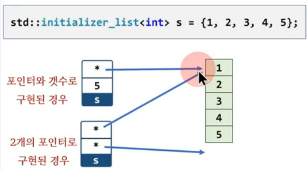

## std::initializer_list<T>
1) <initializer_list> 헤더, C++11에서 도입
2) const T 타입의 이름없는 배열(prvalue)를 생성후, 해당 메모리를 가리키는 객체
3) `포인터 2개` 또는 `포인터와 길이`로 구현



## std::initializer_list<T> 멤버 함수
1) size() : 요소의 갯수 반환
2) begin() : 첫번째 요소를 가리키는 주소(const T*) 반환
3) end() : 마지막 다음 요소를 가르키는 주소(const T*) 반환

```c++
#include <print>
#include <initializer_list>

int main()
{
	std::initializer_list<int> s = {1, 2, 3, 4, 5};

//	int* first = s.begin();	// error

	const int* first = s.begin();	
	const int* lst   = s.end();

	for( auto e : s)
	{
		std::println("{}", e);
	}
}
```

## std::initializer_list<T>는 언제 사용하는가?
1) 함수(특히 생성자) 인자로 많이 사용
2) 크기가 크지 않은 타입이므로 call by value로 받는 것이 관례

```c++
#include <initializer_list>

void foo( std::initializer_list<int> s) {}

int main()
{
	std::initializer_list<int> s = {1, 2, 3, 4, 5};

	foo( s );

	foo( {1, 2, 3} );
	foo( {1, 2, 3, 4, 5} );
}

```

## 왜 일반 배열 대신 std::initializer_list를 사용하는가?

## 배열을 인자로 보내는 경우 포인터로 받게 된다.
1) 시작 주소만 알수 있고, 갯수를 알수 없다.
2) list initialization({1,2,3}) 형태로 인자를 전달할수 없다.


```c++
#include <initializer_list>

void f1( int* p ) {}
void f2( std::initializer_list<int> s) {}

int main()
{
	int x[5] = {1, 2, 3, 4, 5};
	f1( x );
//	f1( {1,2,3} );	// error

	std::initializer_list<int> s = {1, 2, 3, 4, 5};
	f2( s );		// ok
	f2( {1,2,3} );	// ok
//	f2( x );		// error
}
```

## 가장 큰 특징은
1) 생성자가 인자로 std::initializer_list를 사용하는 경우 특별한 규칙이 적용된다.

## Object o1(1,2);
1) Object(int, int) 호출

## Object o2( {1,2} );
1) Object(std::initializer_list) 호출

## Object o3{1,2};
1) Object(std::initializer_list) 호출
2) 1번이 없다면 Object(int, int) 호출

## 생성자 인자로 std::initializer_list를 사용하면
1) 객체를 배열처럼 초기화할수 있게 된다.
2)  {} 초기화를 사용하면 std::initializer_list 버전의 생성자가 우선순위로 선택됨.
3)  C++11부터 STL container는 배열처럼 초기화 가능.

```c++
#include <print>

class Object
{
public:
	Object()          { std::println("1");}
	Object(int, int)  { std::println("2");}
	Object(std::initializer_list<int>) { std::println("3");}
};

int main()
{
	Object o1;			// 1
	Object o2(1, 2);	// 2
	Object o3({1,2});	// 3

	Object o4{1, 2};	// 3

//	Object o5(1, 2, 3); // error. Object(i, i, i) X
	Object o6{1, 2, 3}; // ok
	Object o7 = {1, 2, 3}; // ok
}
```

## STL container 사용시 () 초기화, {} 초기화의 차이점을 알아둘 것
| | |
|--|--|
| std::vector v1(10,2) | vector(int, int) 생성자 <br> 10개의 요소를 2로 초기화 |
| std::vector v1{10,2} | vector(std::initializer_list) 생성자  <br> 2개의 요소를 10, 2로 초기화|
| std::vector v3 = 10  | explicit vector(int)|
| std::vector v4 = {10}| vector(std::initializer_list) <br> explicit 아님 |
