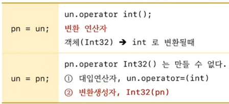
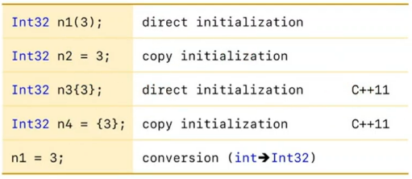

## 객체 변환에 대한 다양한 문법과 기법
1) 변환 연산자, 변환 생성자, explicit 생성자
2) safe bool 개념과 explicit 변환 연산자
3) nullptr과 return type resolver 기술
4) temporary proxy 기술
5) lambda expression과 함수 포인터 변환

## 변환 연산자
1) 객체가 다른 타입으로 변환될때 호출되는 함수
   ```c++
   operator TYPE() const // 상수 멤버 함수로 만드는 경우 많이 있다.
   {
	 return 값;
   }
   ```
2) 반환 타입을 표기하지 않는다. 함수 이름에 반환 타입이 포함되어 있다.

```c++
#include <iostream>

class Int32
{
	int value;
public:
	Int32()      : value(0){}
	Int32(int n) : value(n){}

	operator int() const { return value;}
};

int main()
{
	int   pn;
	Int32 un;
	
	pn = un; // un.operator int()
	un = pn; // pn.operator Int32() 는 만들수 없다
			 // 1. un.operator=(pn)
			 // 2. Int32(pn)
}

```

## 변환 연산자 vs 변환 생성자
1) int pn, Int32 un 일때




## 변환 생성자 (인자가 한 개인 생성자)가 있다면




```c++
#include <iostream>

class Int32
{
	int value;
public:
	Int32(int n) : value(n){}

//	Int32(const Int32&) = delete;
//	Int32& operator=(const Int32&) = delete;
};

int main()
{
	Int32 n1(3);
	Int32 n2 = 3; 
	Int32 n3{3};
	Int32 n4 = {3};	

	n1 = 3;
}

```

## Int32 n2 = 3;  ==> Int32 n2 = Int32(3);

## C++14까지
1) 인자가 한개인 생성자를 사용해서 `Int32 임시객체 생성`
2) 생성된 임시객체를 `복사 생성자(C++98)` 또는 `move 생성자(C++11이후)`를 사용해서 n2에 복사(이동)
3) 대부분 컴파일러가 `최적화를 통해서 임시객체 생성이 제거` 됨
4) 디폴트 대입연산자가 삭제된 경우는 `컴파일 에러` 발생

## C++17부터
1) 임시객체를 생성하지 않고, 인자 한개인 생성자 호출

