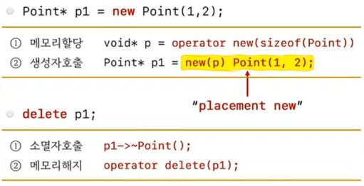

```c++
#include <iostream>
#include <new>

class Point
{
	int x, y;
public:
	Point(int a, int b) : x{a}, y{b} { std::cout << "Point(int, int)"  << std::endl; }
	~Point()		 				 { std::cout << "~Point()" << std::endl; }
};

int main()
{
//	Point* p1 = new Point(1,2);
//	delete p1;

	void* p = operator new(sizeof(Point));
	
	std::cout << p << std::endl;

	operator delete(p);

}

```

## new / delete


```c++
#include <iostream>
#include <new>
#include <memory>

class Point
{
	int x, y;
public:
	Point(int a, int b) : x{a}, y{b} { std::cout << "Point(int, int)"  << std::endl; }
	~Point()		 				 { std::cout << "~Point()" << std::endl; }
};

int main()
{
	void* p1 = operator new(sizeof(Point));

	Point* p2 = new(p1) Point(1, 2); // 생성자 호출

	p2->~Point();

	operator delete(p1);


	Point* p3 = static_cast<Point*>(operator new(sizeof(Point)));
	
	std::construct_at(p3, 1, 2);
	std::destroy_at(p3);
	operator delete(p3);
}
```

## operator new() / operator delete()
1) 메모리를 할당/해지 하는 C++ 표준 함수
2) `<new>` 헤더
3) std namespace 아닌 global namespace
```c++
 [[nodiscard]] void* operator new(std::size_t);
 void operator delete(void* ptr) noexcept;
```

## placement new
1) 메모리 할당없이 `이미 할당된 메모리에 대해 생성자를 명시적으로 호출` 하기 위한 new

```c++
new  Point(1,2);      // 새로운 메모리를 할당하고 객체 생성 (생성자 호출)
new(p)  Point(1,2);   // 이미 할당된 메모리(p)에 객체 생성 (생성자만 호출)
```

## 생성자를 명시적으로 호출하는 방법
```c++
new(p) Point(1,2);         // 1)
std::construct_at(p,1 2);  // 2) C++20, <memory>
```

## 소멸자를 명시적으로 호출하는 방법
```c++
p->~Point();         // 1)
std::destroy_at(p);  // 2) C++17, <memory>
```

## 객체를 생성/파괴 하는 방법
1) 방법1. new / delete 사용
2) 방법2. 메모리 할당과 생성자 호출을 분리

```c++
// 메모리 할당
operator new(sizeof(Point));

// 생성자 호출
new(p) Point(1,2);          // 1) placement new
std::construct_at(p, 1, 2); // 2) C++20

// 소멸자 호출
p->~Point();         // 1)
std::destroy_at(p);  // 2) C++17

// 메모리 해지
operator delete(p);
```