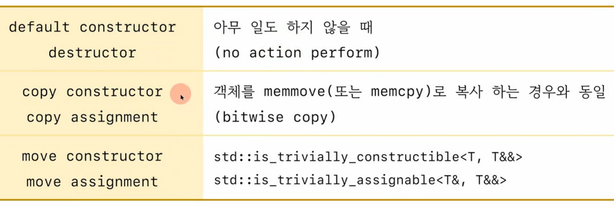

## special member function
1) 사용자가 제공하지 않으면 `컴파일러가 제공하는 멤버 함수`
   1) 디폴트 생성자, default constructor
   2) 소멸자, destructor
   3) 복사 생성자, copy constructor
   4) 복사 대입연산자, copy assignment
   5) 이동 생성자, move constructor
   6) 이동 대입연산자, move assignment

# Trivial 조건
## 컴파일러가 생성하는 special member function이 다음과 같은 경우

1) defautl constructor / destrcutor : 아무 일도 하지 않을때
2) copy constructor / assignment : 개체를 memmove(또는 memcpy)로 복사하는 경우와 동일
3) move constructor / assignment : std::is_trivially_constructible<T, T&&>
                                   std::is_trivially_assignalble<T&, T&&>


## trivially default constructor
1) 컴팡일러가 생성하는 디폴트 생성자가 
2) 아미 일도 하지않은 경우. (no action perform)
   1) 다음의 모든 조건을 만족해야 한다.
        1) The constructor is no user-provided
        2) T has no virtual member fucntion
        3) T has no virtual base classes
        4) T has no non-static members with default initializers
        5) Every direct base of T has a trivial default constructor
        6) Every non-static member of class has a trivial default constructor
   
## 조사하는 방법 - type_traits 사용
1) std::is_trivially_defualt_constructible<T>::value    :  C++11
2) std::is_trivially_default_constructible_v<T>         :  C++17

```c++
#include <iostream>
#include <type_traits>

struct TrivialDefaultCtor	 // true	
{
	int data;
};

struct NonTrivialDefaultCtor  // false, user defined default constructor
{
	int data;
	NonTrivialDefaultCtor() {}
};

struct Type1
{
	// 컴파일러가 디폴트 생성자 제공안함. - false
	Type1(int a) {}
};

struct Type2
{
	Type2() {};			// false
	Type2(int a) {}
};

struct Type3
{
	Type3() = default;	// true
	Type3(int a) {}
};

struct Type4		// false
{
	int data = 0;

	//
//	int data;
//	Type4() : data(0) {}
};


struct Type5  // false
{
	int data;
	virtual void foo() {}
};


struct Type6 // false 
{
	int data1;
	NonTrivialDefaultCtor data2;

//	Type6() : data2() {} // 컴파일러가 추가한 코드
};


struct Type7 // true
{
	int data1;
	TrivialDefaultCtor data2;
//	Type7() : data2() {} // 컴파일러가 추가한 코드

};


// false 
struct Type8 : public NonTrivialDefaultCtor 
{
	int data;
};


// true
struct Type9 : public TrivialDefaultCtor
{
	int data;
};


// false
struct Type10 : public virtual TrivialDefaultCtor
{
};

// false
struct Type11
{
	Type11() = delete;
};

// false
struct Type12
{
	int& ref; // 참조 멤버가 있으면
				// 디폴트 생성자는 =delete됨.
};
//Type12 t;

// false
struct Type13
{
	const int c;
};

template<class T> void check()
{
	std::cout << typeid(T).name() << " : ";
	std::cout << std::boolalpha;
	std::cout << std::is_trivially_default_constructible_v<T> << std::endl;
};

int main()
{
	check<TrivialDefaultCtor>();    // true
	check<NonTrivialDefaultCtor>(); // false
	check<Type1>();
	check<Type2>();
	check<Type3>();
	check<Type4>();
	check<Type5>();
	check<Type6>();
	check<Type7>();
	check<Type8>();
	check<Type9>();
	check<Type10>();
	check<Type11>();
	check<Type12>();	
	check<Type13>();	
}
```


