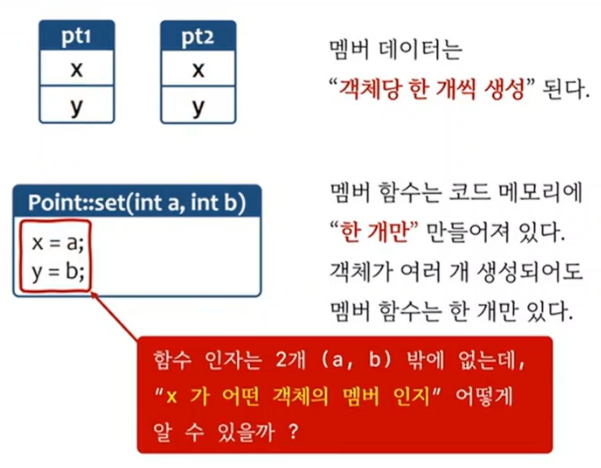

```c++
class Point
{
	int x{0};
	int y{0};
public:
	void set(int a, int b)
	{
		x = a;
		y = b;
	}
};

int main()
{
	Point pt1;
	Point pt2;

	pt1.set(10, 20);
	pt2.set(10, 20);
} 
```

# 멤버함수의 호출원리 (this call)


1) 멤버 함수 호출시
   1) 객체의 주소가 같이 전달된다.
   2) this call 이라고 한다.

## 주의
1) 실제 함수 인자가 전달되는 방식과 객체 주소가 전달되는 방식은 약간의 차이가 있다.
2) (32bit/64bit 환경, 컴파일러에 따라서도 차이가 있음)

```c++
class Point
{
	int x{0};
	int y{0};
public:
	void set(int a, int b)
	{
		x = a;
		y = b;
	}
	static void foo(int a)
	{
		x = a; 	// this->x = a 가 되어야 하는데
				// this가 없다. 
				// error
	}
};
int main()
{
	Point pt1;
	Point pt2;

	pt1.set(10, 20); // set(&pt, 10, 20)
	pt2.set(10, 20);

	Point::foo(10);
	pt1.foo(10);
}
```

## static 멤버함수와 this
1) static 멤버함수는 객체의 주소 전달되지 않는다.
2) this call 아님
3) 객체의 주소를 알수 없기 때문에 멤버 변수(x,y)에 접근할수 없다.(static 멤버변수만 접근 가능)


