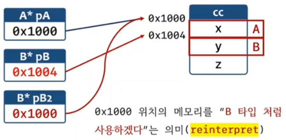
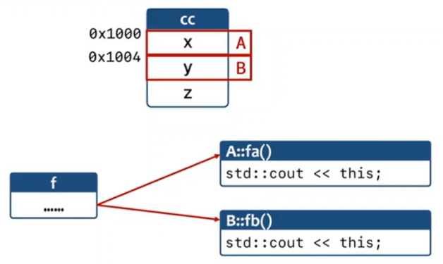
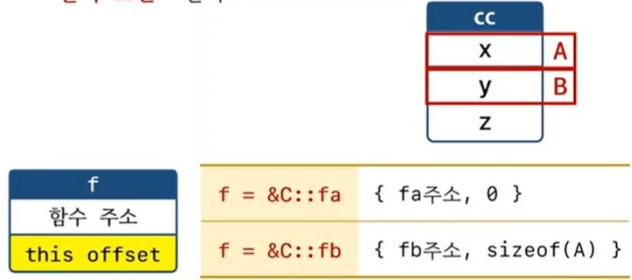

```c++
#include <iostream>

struct A { int x;};
struct B { int y;};
struct C : public A, public B 
{
	 int z;
};

int main()
{
	C cc;
	std::cout << &cc << std::endl; // 1000 

	A* pA = &cc;
	B* pB = &cc;
	B* pB1 = static_cast<B*>(&cc);
	B* pB2 = reinterpret_cast<B*>(&cc);

	pB2->y = 10; // 결국 cc.x 에 대입

	std::cout << cc.x << std::endl; // 10
	std::cout << pA << std::endl; // 1000
	std::cout << pB << std::endl; // 1004
	std::cout << pB1 << std::endl; // 1004
	std::cout << pB2 << std::endl; // 1000
}

```

## 기반 클래스 포인터로 파생 클래스 객체를 가리킬 때
1) `객체 안에 있는 기반 클래스 위치`를 가리킨다.
2) 다중 상속일 경우 객체의 주소와 다를수 있다.




## static_cast vs reinterpret_cast
1) static_cast : 인자로 전달된 주소 안에서 기반 클래스의 위치(주소)가 반환된다. 상속관계가 아닌 경우 에러.
2) reinterpret_cast : 항상 인자로 전달된 주소가 동일하게 반환된다. 상속관계가 아니어도 에러 아님. 해당 `메모리를 다르게(다른 타입으로) 해석 하겠다` 는 것
 

 ```c++
#include <iostream>

struct A 
{
	int x;
	void fa() { std::cout << this << std::endl;}
};
struct B 
{
	int y;
	void fb() { std::cout << this << std::endl;}
};
struct C : public A, public B 
{
	int z;
	void fc() { std::cout << this << std::endl;}
};
int main()
{
	C cc;
	cc.fc(); // 0x1000
	cc.fa(); // 0x1000
	cc.fb(); // 0x1004

	void(C::*f)();

//	f = &C::fa;
	f = &C::fb;

	(cc.*f)(); // 0x1000 ? 0x1004
				// f(&cc)
				// f(&cc + sizeof(A))
}

 ```

 
 
 ## (cc.*f)() 로 호출할때
1) f = &A::fc 인 경우 : f(&cc) 가 되어야 한다.
2) f = &B::fb 인 경우 : f(&cc + sizeof(A)) 가 되어야 한다. 즉, 0x1000번지가 아닌 Ox1004 번지가 되어야 한다.

```c++
#include <iostream>

struct A 
{
	int x;
	void fa() { std::cout << this << std::endl;}
};
struct B 
{
	int y;
	void fb() { std::cout << this << std::endl;}
};
struct C : public A, public B 
{
	int z;
	void fc() { std::cout << this << std::endl;}
};
int main()
{
	C cc;

	void(C::*f)();

	std::cout << sizeof(f) << std::endl; // 16byte(64bit)

//	f = &C::fa;
	f = &C::fb; 

	(cc.*f)(); // f.함수주소(&cc + f.this_offset)

	void* p = f; // error. 
}
```

## 멤머함수 포인터의 크기
1) 항상 4byte(32bit)/8byte(64bit) 인 것은 아니다.
2) 코드에 따라 멈버함수 포인터의 크기가 달라진다.
3) 다중 상속의 경우 `함수 주소와 this offset을 같이 보관`한다.



## c++ 표준 동작은 아님. 컴파일러마다 원리가 다를수 있음. 가상 상속 등을 사용하면 12byte(32bit 환경)가 되는 경우도 있음

## void*와 pointer to member
1) void*에 멤버함수 포인터를 담을 수 없다.
2) void*에 멤버데이터 포인터를 담을 수 없다.

```c++
#include <iostream>

struct Point
{
	int x, y;
};

int main()
{
	int Point::*p = &Point::y;   // 4

	std::cout << p << std::endl; // 1

	printf("%p\n", p);  // 4
}
```

```c++
#include <iostream>

struct Point { int x, y;};

struct myostream
{
	myostream& operator<<(int    n) { printf("int    : %d\n", n); return *this;}	
	myostream& operator<<(double d) { printf("double : %f\n", d); return *this;}	
	myostream& operator<<(bool   b) { printf("bool   : %d\n", b); return *this;}	
	myostream& operator<<(void*  p) { printf("void*  : %p\n", p); return *this;}	
	myostream& operator<<(const char* s) { printf("char* : %s\n", s); return *this;}	
};
myostream mycout;

int main()
{
	int n = 10;
	double d = 3.4;
	int Point::*p = &Point::y; 

	mycout << n;  // int
	mycout << d;  // double
	mycout << &n; // void*
	mycout << &d; // void* 
	mycout << p;  // bool   값 4 => 1(true)
}
```

## pointer to member (멤버함수 포인터, 멤버데이터 포인터)와 변환
1) pointer to member는 void*에 담을수 없다.
2) pointer to member는 `bool로 암시적 변환`될수 있다.

