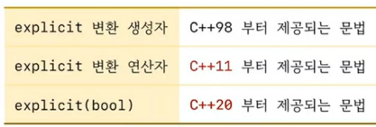

```c++
class Vector
{
public:
	explicit Vector(int size) {}
};

void foo(Vector v) {} // Vector v = 3

int main()
{
	Vector v1(3);
	Vector v2 = 3; // error
	Vector v3{3};
	Vector v4 = {3}; // error

	v1 = 3; // error

	foo(3); // error
}
```

## explicit 생성자
1) 생성자가 암시적 변환의 용도로 사용될수 없게 한다.
2) 직적(direct) 초기화만 가능하고 복사(copy) 초기화는 사용할수 없다.

## 클래스에 따라 explcit를 사용할지를 잘 판단해야 한다.

## 객체의 유효성을 if문으로 조사하고 싶다.
1) operator bool() 제공하면 된다.
2) operator bool()은 side effect가 많다.

## explicit operator bool()
1) C++11부터 생성자 뿐 아니라 `변환 연산자도 explicit를 붙일수 있다.`
2) bool로의 암시적 변환은 허용되지 않는다.
3) if 문 안에서는 사용될수 있다.
4) `safe bool`

```c++
#include <iostream>

class Machine
{
	int  data  = 10;
	bool state = true;
public:
	explicit operator bool() { return state;}
};

int main()
{
	Machine m;

//	bool b1 = m; // error
	bool b2 = static_cast<bool>(m); // ok

//	m << 10;  // error 

	if ( m )
	{		
	}
}
```

## C++ 버전과 explicit



```c++
#include <iostream>
#include <type_traits>

template<class T> 
class Number
{
	T value;
public:
	explicit(!std::is_integral_v<T> ) 
	Number(T v) : value(v) {}
};

int main()
{
	Number n1 = 10; // ok
	Number n2 = 3.4;// error
}
```