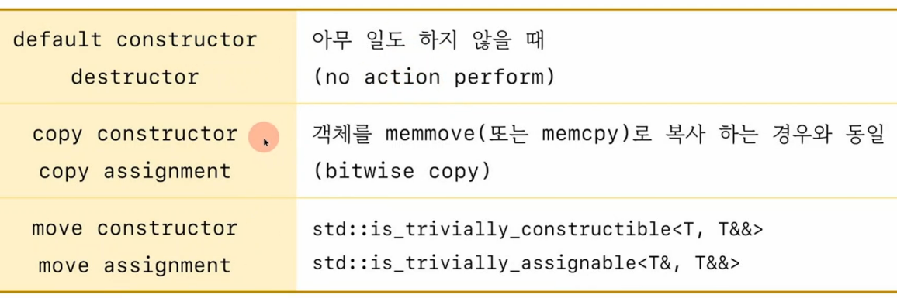

## special member function
1) 사용자가 제공하지 않으면 `컴파일러가 제공하는 멤버 함수`
2) 디폴트 생성자, default constructor
3) 소멸자, destructor
4) 복사 생성자, copy constructor
5) 복사 대입연산자, copy assignment
6) 이동 생성자, move constructor
7) 이동 대입연산자, move assignment

## 컴파일러가 생성하는 special member function이 다음과 같은 경우

