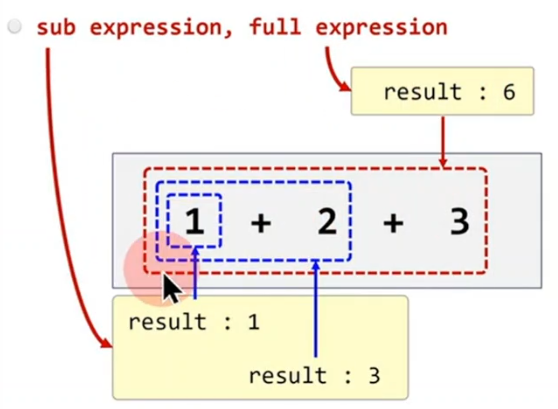

```c++
int main()
{
	int n = 1;

	if ( n == 1 )
	{
		
	}
}
```

## if statement (if 문)
```c++
if (codition)
{
	//...
}
```
1) expression or
2) declaration (with initializer)


## C++에서는 다양한 expression 존재 한다.
1) new expression (C++98)
2) delete expression (C++98)
3) lamba expression (C++11)
4) fold expression (C++17)
5) requires expression (C++20)
6) ...

## expression의 정의는 무엇인가?
1) statement와 차이점은?
2) expression, statement는 C++뿐 아니라 대부분의 프로그래밍 언어에서 사용되는 공통적인 개념(용어)

## C++ vs Rust
1) C++ : if statement
2) Rust : if expression


```c++
int add(int a, int b) { return a + b; }

int main()
{
	int n = 1;

	1 + 2 + 3;
	
	n + 2;

	(n + 2) * 3;

	add(1, 2);

	3;

	n;
}
```

## expression
1) `표현식`이라고 번역
2) `하나의 값(single value, result)`을 만들어내는 코드 집합 (combination of literals, variables, operators, operands, and function calls)

[STD 7.1] Expressions - preamble
1. An expression is
2. a sequcence of operators and operands that specifies a computation.
3. An expression can result in a value and can cause side effects.

## 용어
1) evaluate : expression을 가지고 하나의 값을 만드는 실행 과정
2) result : 표현식의 최종 평가 결과로 생성된 하나의 값(single value)

## sub expression, full expression



```c++
#include <print>

void print_logo()
{
	std::println("logo");
}

int main()
{
	int n;

	1 + 2;

	n = 3;

	print_logo();
}
```

## An expression
1) Can result in a value and 
2) Can cause side effects.

## 1 + 2
1) side effect : none
2) result : 3

## n = 3
1) side effect : 변수 n의 값을 3으로 변경
2) result : n

## print_logo()
1) side effect : 화면에 "logo" 출력
2) result : none 
3) Void expression
4) have no result object


```c++
int main()
{
	int n; 	// declaration statement

    n = 3;	// expression statement
}
```

## expression
1) `하나의 값(result)`를 만들어내는 코드 집합
2) expression은 세미콜론(;)을 포함하지 않는다.

## expression 자체는 컴파일 / 실행될수 없다.
1) expression을 컴파일 / 실행 하려면 statement로 만들어야 한다.
2) expression을 statement로 만들려면 끝에 ;을 붙이면 된다.

## 함수는 statement의 집합(sequence)
1) The body of any function is a sequence of statements

## statement 의 종류
1) expression statement
2) declaration statement
3) labeled statement (goto label, case label, switch label)
4) compound statement
5) selection statement (if, switch)
6) iteration statement (while, do-while, for, range for)
7) jump statement (break, continue, return, goto)
8) try blocks

```c++
int main()
{
	int n;           // declaration statement

	n = 3;           // expression statement

	if ( n == 3 )    // if statement
	{                // compound statement
		int a = 0;   // declaration statement
		a = 10;      // expression statement
	}

	return 0;        // jump statement
} 
```

## 일부 언어는 제어문(if, swich)이 expression으로 분류된다.
1) c++ : if statement
2) Rust : if expression
   1) Rust는 변수의 초기값을 지정할때 if expression 사용 가능

```rust
fn main()
{
	let score = 75;

	let result1 = if ( score > 70 )
	              {"pass"} else {"fail"};
}
```

