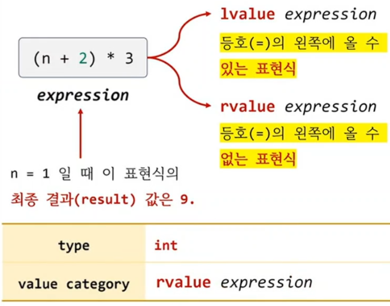
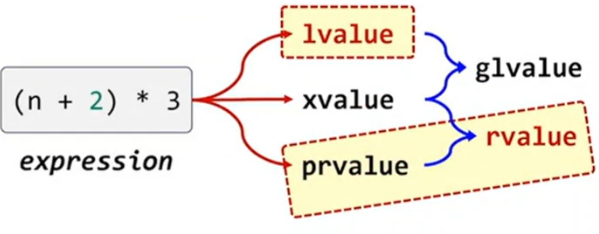

```c++
int main()
{
	int n = 1;

	n = 1; 	// ok.
	1 = n;	// error. 


	auto a = (n + 2) * 3; // int a = 9

	(n + 2) * 3 = 3;	
}
```

## lvalue vs rvalue
1) lvalue : 등호의 왼쪽에 올수 있는 표현식, left value
2) rvalue : 등호의 왼쪽에 올수 없는 표현식, right value

## lvalue, rvalue 개념은
1) 객체(변수)에 적용되는 개념이 아닌
2) 표현식(expression)에 적용되는 개념

## 표현식 (expression)
1) `하나의 값`을 만들어내는 코드 (operator and operands) 집합

## 표현식의 2가지 속성 
1) type : 표현식의 평가(evaluated) 결과로 나오는 값(result)의 타입
2) value category : 표현식을 등호의 왼쪽에 놓을 수 있는가?
   1) lvalue expression : 등호의 왼쪽에 올수 있는 표현식
   2) rvalue expression : 등호의 왼쪽에 올수 없는 표현식




## value category
1) C++98 : lvalue, rvalue의 2가지로 분류
2) C++11 : lvalue, xvalue, prvalue의 3가지로 분류하고, 다시 glvalue, rvale로 분류

## rvalue는 2가지 종류가 있음 (xvalue, prvalue)
1) xvalue(expiring value)는 `move semantics`에서 설명
2) move 이전의 강의 예제에서 나오는 rvalue는 대부분 `prvalue(pure rvalue)`를 의미



### glvalue : lvalue + xvalue
### rvalue : xvalue + prvalue

## lvalue expression
1) 표현식의 결과가 사용자가 할당한 메모리 공간을 가리키게 되는 표현식
2) 표현식의 결과가 IDentifier(name)을 가진다.

## rvalue expression
1) IDentifier(name)가 없다.
2) 3, 2.1 같은 literal
3) 표현식의 평가 결과로 만들어진 값(result)이 `사용자가 명시적으로 할당한 메모리 공간이 아닌 연산의 결과로 만들어진 임시 값`인 경우


```c++
int main()
{
	int n = 1;

	n = 1; // ok
	3 = 1; // error

	n + 2       = 1; // error
	(n + 2) * 3 = 1; // error

	++n = 1; // ok
	n++ = 1; // error
}
```

1) ++n 
   1) n을 1 증가
   2) n 자체를 반환
   3) lvalue expression
2) n++
   1) n의 값 보관
   2) n 증가
   3) 1에서 보관한 값 반환
   4) rvalue(prvalue) expression

## 어떤 표현식이 lvalue인지, rvalue 인지 조사할수 없을까?
1) `decltype(expression)` 강의 참고

```c++
int x = 0;

int  f1() { return x;} // "값 0" 반환
int& f2() { return x;} // "x의 별명" 반환
void f3() {}

int main()
{
	int n = 1;

	(n = 2) = 1;	// ok
	(n + 2) = 1;	// error

	int* p1 = &(n = 2); // ok
	int* p2 = &(n + 2); // error

	f1() = 1; // 0 = 1. error
	f2() = 1; // x = 1. ok
	f3() = 1; // error

	3 = 1;
}
```
1) n = 2
   1) side effect : 변수 n에 2 대입
   2) result : n
   3) lvalue expression
2) n + 2
   1) side effect : none
   2) result : 3
   3) 3은 연산의 결과로 만들어진 임시 값
   4) rvalue(prvalue) expression

## lvaue expression
1) ID를 가진다.
2) expression의 result는 표현식을 벗어나도 계속 메모리에 존재
3) 주소 연산자로 주소를 구할수 있다.
4) reference 타입으로 반환하는 함수
5) 문자열 literal ( "hello" )

## rvalue expression
1) ID가 없다.
2) expression의 result는 현재 표현식에만 사용 가능한 값
3) 주소 연산자로 주소를 구할수 없다.
4) value 타입으로 반환하는 함수
5) void expression
6) 정수, 실수 literal (3, 3.4)
7) temporary ( "temporary" 강의 참고)

```c++
int main()
{
	const int c = 1;

	c = 1; 	// error.
			// "c" 
			// 1. lvalue expression => ok
			// 2. rvalue expression

	int n = 1;
	n + 1 = 3;
}
```

## c 가 const int 일때 "c"라는 expression은 
1) ID가 있고
2) &c로 주소도 구할수 있다.
3) 단일식을 벗어나서도 계속 메모리에 존재
4) immutable lvalue expression

## rvalue expression이 만드는 값 (result)는 상수이다?
1) 아님
2) 임시값 이라서 등호의 왼쪽에 올수 없는 것
3) "temporary" 강의 참고


 