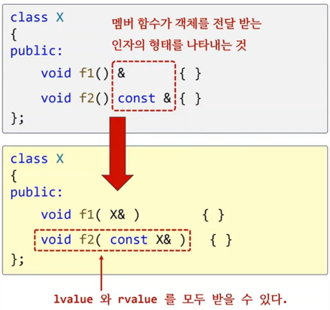

```c++
#include <print>

class X
{
public:
	void f1()    { std::println("f1()");}    // lvaue / rvalue 모두 호출
	void f2() &  { std::println("f2() &"); } // lvaue 호출
	void f2() && { std::println("f2() &&");} // rvalue 호출
	void f3() && { std::println("f3() &&");} // rvalue 호출
};
int main()
{
	X obj;

	obj.f1();
	X{}.f1();

	obj.f2(); // &
	X{}.f2(); // &&

//	obj.f3(); // error
	X{}.f3(); // ok
}
```

## reference qualifier
1) 멤버함수 뒤에 reference 연산자(&, &&) 붙이는 문법
2) lvalue / rvalue 여부에 따라 다른 멤버 함수를 호출하게 할수 있다.

## 이 문법은 언제 사용할까?
1) getter & move 강의 참고

## non-static member function qualifier / specifier
1) cv-qualifier : const, volatile
2) ref-qualifier : &, &&
3) noexcept specifier
4) override / final specifier 

```c++
#include <print>

class X
{
public:
	void foo() &        { std::println("foo &");} 
	void foo() &&       { std::println("foo &&");}
	void foo() const &  { std::println("foo const &");}
	void foo() const && { std::println("foo const &&");}
	void foo() volatile &  		{ std::println("foo volatile &");} 
	void foo() volatile && 		{ std::println("foo volatile &&");}
	void foo() const volatile &	{ std::println("foo const volatile &");} 
	void foo() const volatile &&{ std::println("foo const volatile &&");}

	virtual void goo() const volatile && noexcept final 
	{ 
		std::println("foo const volatile &&");
	}
};

int main()
{
	X obj;
	const X cobj;
	volatile X vobj;
	const volatile X cvobj;

	obj.foo();
	cobj.foo();
	vobj.foo();
	cvobj.foo();

	using CX = const X;
	using VX = volatile X;
	using CVX = const volatile X;

	X{}.foo();
	CX{}.foo();
	VX{}.foo();
	CVX{}.foo();
}
```

```c++
class X
{
public:
	void f1() &       { }
	void f2() const & { }	
};

int main()
{
	X obj;

	obj.f1(); // ok
//	X{}.f1(); // error

	obj.f2(); // ok  f2(obj)
	X{}.f2(); // ok  f2(x{})
}
```

 