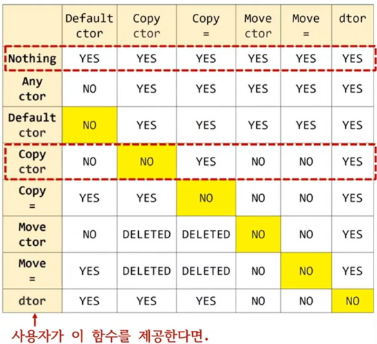
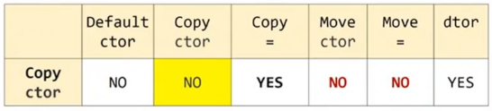
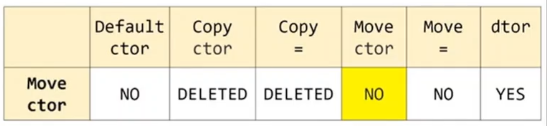

```c++
#include "String.h"

int main()
{
	String s1{"s1"};
	String s2 = s1;				// copy
	String s3 = std::move(s1);	// move
}
```

## 복사 생성자를 사용자가 만들지 않으면 컴파일러가 제공한다.
1) 그렇다면, 이동 생성자를 만들지 않으면 컴파일러가 제공할까?

## Special Member Function
1) 사용자가 만들지 않으면 컴파일러가 제공하는 6개의 멤버 함수
   1) 디폴트 생성자, default constructor
   2) 소멸자, destructor
   3) 복사 생성자, copy constructor
   4) 이동 생성자, move constructor
   5) 복사 대입 연산자, copy assignment operator
   6) 이동 대입 연산자, move assignment operator

## 컴파일러가 special member function을 제공하는 규칙


|사용자 제공하면   |default ctor	|copy ctr|copy =	|move ctor	|move =	|dtor	|
|--				|--				|--		|--		|--			|--		|--	|
|Nothing		   |YES			   |YES		|YES	   |YES		   |YES	   |YES	|
|Any ctor		|NO			   |YES		|YES	   |YES		   |YES	   |YES	|
|Default ctor	|NO			   |YES		|YES	   |YES		   |YES	   |YES	|
|Copy Ctor		|NO			   |NO		|YES	   |NO			|NO		|YES	|
|Copy =			|YES			   |YES		|NO		|NO			|NO		|YES	|
|Move Ctor		|NO			   |DELETED	|DELETED |NO			|NO		|YES	|
|Move =			|YES			   |DELETED	|DELETED |NO			|NO		|YES	|
|Dtor			   |YES			   |YES		|YES	   |NO			|NO		|NO	|


```c++
#include "String.h"

struct Object
{
	String name;

};

int main()
{	
	Object o1{"o1"};
	Object o2{"o2"};

	Object o3 = o1;				// 
	Object o4 = std::move(o2);	// 

	std::println("{}", o1.name.c_str()); // "o1"
	std::println("{}", o2.name.c_str()); // ""
}
```

## 아래 5개의 멤버 함수를 사용자가 모두 제공하지 않으면 컴파일러가 모두 제공한다.
1) 생성자 제공 여부와는 관련 없음.
   1) 복사 생성자
   2) 이동 생성자
   3) 복사 대입 연산자
   4) 이동 대입 연산자
   5) 소멸자

## 컴파일러가 제공하는 복사 계열 함수는 (복사 생성자, 복사 대입 연산자)
1) 모두 멤버 데이터를 복사

## 컴파일러가 제공하는 이동 계열 함수는 (이동 생성자, 이동 대입 연산자)
1) 모두 멤버 데이터를 이동

1) 사용자가 복사, 이동 계열의 함수를 만들지 않았지만 컴파일러가 모두 제공
2) 즉, 복사와 이동을 모두 지원하는 클래스, 좋은 클래스
3) 복사와 이동 계열 함수는 사용자가 만들지 않는 것이 가장 좋다.


```c++
#include "String.h"

struct Object
{
	String name;
	Object(const String& n) : name(n) {}

	// # 사용자가 복사 생성자를 제공한 경우.
	Object(const Object& other) : name{other.name}
	{
		std::println("Object Copy");
	}

	Object(Object&&) = default;
	Object& operator=(const Object&) = default;
	Object& operator=(Object&&) = default;		
};
int main()
{	
	Object o1{"o1"};
	Object o2{"o2"};
	std::println("-------------");

	Object o3 = o1;				
	Object o4 = std::move(o2);	
}
```

## 사용자가 `복사 생성자를 제공` 하면


1. 컴파일러는 이동 계열 함수를 모두 제공하지 않는다.
   1. 사용자가 복사 생성자를 제공하는 것은 `사용자가 복사 정책을 변경`한다는 의미
   2. 복사 정책을 사용자가 결정했으므로 컴퍼일러가 임의로 `이동 정책을 제공`하는 것은 논리적으로 맞지 않다.

2. 이동 생성자가 필요한 코드가 있다면
   1. 에러가 아니라 사용자가 만든 복사 생성자 사용

3. 컴파일러에게 이동 생성자의 디폴트 버전을 요청하려면 
   1. => default 사용
4. 생각해 볼 문제
   1. 복사 생성자를 사용자가 만들었는데,
   2. 컴파일러가 복사 대입을 제공하는 것이 올바른 동작인가? No

```c++
#include "String.h"

struct Object
{
	String name;
	Object(const String& n) : name(n) {}

	// # 사용자가 이동 생성자를 제공한 경우.
	Object(Object&& other) : name{std::move(other.name)}
	{
		std::println("Object move");
	}
};
int main()
{	
	Object o1{"o1"};
	Object o2{"o2"};
	std::println("-------------");

	Object o3 = o1;			// error	
	Object o4 = std::move(o2);	
}
```

## 사용자가 `이동 생성자를 제공`하면

1. 복사 생성자가 필요한 코드가 있다면
   1. 컴파일 에러
   2. = default 로 디폴트 버전 요청 가능


```c++
#include <cstring>
#include <string>
#include <utility>

class Object
{
	std::string	name1;
	std::string name2;
	int   		data;
public:
	Object(const std::string& s1, const std::string& s2, int d)
	 	: name1{name1}, name2{s2}, data{d}
	{
	}
};

int main()
{
	Object o1{"name1", "name2", 20};

	Object o2 = o1;
	Object o3 = std::move(o1);

	o2 = o1;
	o3 = std::move(o2);
}
```

## 클래스 내부에 포인터 같은 멤버가 없고 사용자가 직접 자원을 관리하지 않는다면, 아래 5개 함수를 만들 필용가 없다.
1) 복사 생성자
2) 이동 생성자
3) 복사 대입 연산자
4) 이동 대입 연산자
5) 소멸자

## 위 5개를 만들지 않으면 `없는 것이 아니라` 컴파일러가 모두 제공한다.
1) copy와 move를 모두 제공하는 좋은 클래스!!!!
2) rule of 0
   1) 되도록 이면 위 5개를 만들지 말라는 의미


