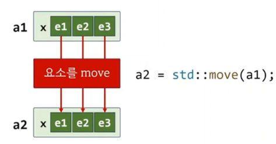

```c++
#include <utility>

struct ARRAY
{
	int x[3];
};

int main()
{
	int x1[3] = { 1,2,3 };
//	int x2[3] = x1;				// error
//	int x3[3] = std::move(x1);	// error

	ARRAY a1 = { 1, 2, 3 };
	ARRAY a2 = a1;				// ok
	ARRAY a3 = std::move(a1);	// ok

}
```

## array 와 copy, move
1) 배열은 복사(이동)될 수 없다.
2) 하지만, 배열을 멤버로 가진 clas(struct)는 복사 이동 될수 있다.

## 객체의 멤버로 배열이 있을때
1) 객체 자체를 std::move 하면
2) 배열의 요소가 move 된다.


```c++
#include <string>
#include <print>

template<typename ARRAY>
void print(const ARRAY& arr)
{	
	std::size_t sz = std::size(arr.x);

	std::print("[ {}", arr.x[0]);

	for(std::size_t i = 1; i < sz; i++)
		std::print(", {}", arr.x[i]);
	std::println(" ]");
}

template<typename T, std::size_t N>
struct ARRAY
{
	T x[N];
};

int main()
{
	ARRAY<int, 3> a1 = {1, 2, 3};
	ARRAY<int, 3> a2 = std::move(a1);

	ARRAY<std::string, 3> a3 = {"A", "B", "C"};
	ARRAY<std::string, 3> a4 = std::move(a3);

	print(a1);
	print(a2);
	print(a3);
	print(a4);
}
```

## ARRAY<int, 3> a2 = std::move(a1);
1) 요소의 타입이 primitive 이므로 복사와 동일한 효과

## ARRAY<std::string, 3> a4 = std::move(a3);
1) 각각의 string에 대해서 std::move로 이동


```c++
#include <vector>
#include <array>
#include "cmc.h"

int main()
{
	std::vector<int>    v1{1, 2, 3};
	std::array<int, 3>  a1{1, 2, 3};

	auto v2 = std::move(v1);
	auto a2 = std::move(a1);

	show(v1); // [ ]
	show(v2); // [ 1, 2, 3 ] 
	show(a1); // [ 1, 2, 3 ]
	show(a2); // [ 1, 2, 3 ]
}
```

## std::vector vs std::array
1) std::vector  : 모든 요소를 동적으로 할당한 메모리(힙)에 보관
2) std::array   : 지역 변수로 객체를 생성한 경우 모든 요소를 stack에 보관. 강의 예제에서 만든 ARRAY와 유사

```c++
#include <vector>
#include <array>
#include <string>
#include "cmc.h"

int main()
{
	std::vector<std::string>    v1{"A", "B", "C"};
	std::array<std::string, 3>  a1{"A", "B", "C"};

	auto v2 = std::move(v1);
	auto a2 = std::move(a1);

	show(v1); // [ ]
	show(v2); // [ "A", "B", "C" ]
	show(a1); // [ "", "", "" ]
	show(a2); // [ "A", "B", "C" ]
}
```
