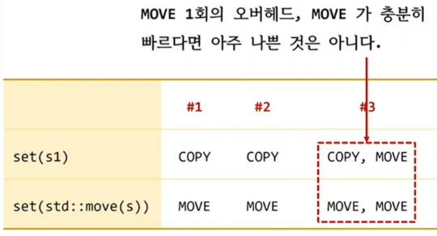

```c++
#include "String.h"

struct Object
{
	String name;

	// #1. 2개의 setter method.
//	void set(const String& n) { name = n; }	
//	void set(String&& n)      { name = std::move(n); }

	// #2. 
	template<typename T>
	void set(T&& n)
	{
//		name = n;
//		name = std::move(n);
		name = std::forward<T>(n);
	}
};

int main()
{	
	Object obj;

	String s1 = "s1";
	String s2 = "s2";	

	obj.set(s1);
	obj.set(std::move(s2));
}
```

## 방법1. 2개의 setter 멤버 함수 제공
1) 2개의 setter 메소드를 제공하는 것

## 방법2. forwarding reference(T&&)을 사용하면 2개의 함수를 자동 생성할 수 있다.
1) 장점: 한 개의 함수(템플릿)으로 copy와 move 모두 지원
2) 단점: 의도하지 않은 side effect가 발생할수 있다.

## 방법2. forwarding reference 방식의 단점
1) 템플릿(T)이므로 `name = n`을 만족하는 임의의 타입에 대해서 인스턴스화 될 수 있다.

## 해결책
1) 조건을 만족하는 경우에만 template instantiation이 될수 있도록 제약을 추가한다.
   1) C++20 이후 Concept 기술
   2) C++20 이전 std::enable_if 기술

```c++
#include <string>
#include <concepts>
#include <type_traits>

struct Object
{
	std::string name;

	// # since C++20 
	template< std::convertible_to<std::string> T>
	void set1(T&& n) 
	{		
		name = std::forward<T>(n);
	}	

	// # until C++17
	template<typename T>
	std::enable_if_t< 
		std::is_convertible_v<std::decay_t<T>, std::string>>
	set2(T&& n)
	{
		name = std::forward<T>(n);
	}	

};

int main()
{	
	Object obj;

	obj.set1("AA");	// ok
	obj.set2("AA"); // ok
//	obj.set1(65);	// error
//	obj.set2(65);	// error
}
```

## 방법3. call by value
1) user define type에 대해서 call by value 나쁘지 않나요?
   1) bad     : void set(String n) { name = n; }
   2) not bad : void set(String n) { name = std::move(n); }

```c++
#include "String.h"

struct Object
{
	String name;
	
//	void set(String n) { name = n; } 
	void set(String n) { name = std::move(n); }	

	// #1
	void set1(const String& n) { name = n; }	
	void set1(String&& n)      { name = std::move(n); }	
};

int main()
{	
	Object obj;

	String s1 = "s1";
	String s2 = "s2";	

	obj.set(s1);			// COPY, MOVE		
	obj.set(std::move(s2));	// MOVE, MOVE

	obj.set1(s1);			// COPY
	obj.set1(std::move(s2));// MOVE	
}
```

## move를 지원하는 setter를 만들려면
1) 방법1. 2개의 setter 멤버 함수 제공
2) 방법2. forwarding reference 사용
3) 방법3. call by value


