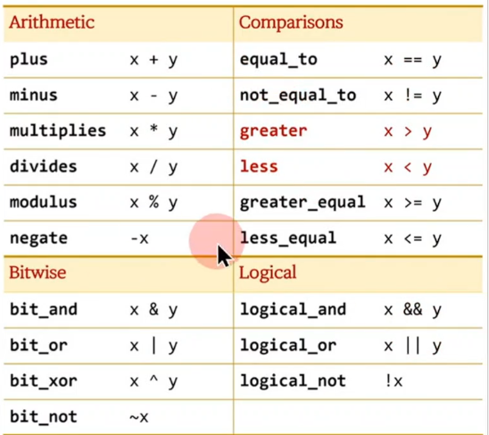

 ```c++
#include <algorithm>

int main()
{
	auto ret1 = std::max(1, 2);
	auto ret2 = std::ranges::max(1, 2);
	auto ret3 = std::ranges::max.operator()(1,2);
}
 ```
## C++ 표준 함수 객체 ( C++98 ~ )
1) `<funtional>` 헤더



## C++20에서 추가된 constrained algorithm
1) C++98 시절의 알고리즘의 기능에 추가로 편리한 다양한 기능 (projection 등) 추가
2) `std::ranges` namespace 안에 제공
3) 모두 함수가 `함수 객체` 행태로 제공
   1) std::max         : 함수 (템플릿)
   2) std::ranges::max : 함수 객체, operator()가 템플릿

```c++
namespace Graphics
{
	struct Point
	{
		int x, y;
	};
	void draw_pixel(const Point& pt) {}
};

int main()
{
	Graphics::Point pt{1, 2};

	Graphics::draw_pixel(pt);

	draw_pixel(pt); // ok
}
```

## ADL (Argument Dependent Lookup)
1) 함수를 찾을때 인자가 속해 있는 이름 공간은 자동으로 검색하는 문법
2) 특정 namespace 안에 있는 객체 등에 연산자 재정의 문법 등을 사용하려면 ADL 개념이 필요하다.

```c++
namespace Graphics
{
	struct Point
	{
		int x, y;
	};
	Point operator+(const Point& p1, 
					const Point& p2)
	{
		return Point{p1.x + p2.x, p1.y + p2.y};
	}
};

int main()
{
	Graphics::Point p1{1, 1};
	Graphics::Point p2{2, 2};
	
	auto ret1 = Graphics::operator+(p1, p2);
	auto ret2 = p1 + p2;	// operator+(p1, p2);
}
```

```c++
#include <algorithm>
#include <string>

int main()
{
	int n1 = 10;
	int n2 = 20;

	std::string s1 = "AA";
	std::string s2 = "BB";

	auto ret1 = std::max(n1, n2); // ok
	auto ret2 = std::max(s1, s2); // ok
	auto ret3 = max(n1, n2); // error
	auto ret4 = max(s1, s2); // ok
}
```

```c++
#include <print>

namespace mystd
{
	class string {};

	template<typename T> 
	void max(const T& a, const T& b) { std::println("std::max"); }

	namespace ranges
	{
//		template<typename T> 
//		void max(const T& a, const T& b) { std::println("std::ranges::max"); }

		struct max_fn
		{
			template<typename T> 
			void operator()(const T& a, const T& b) { std::println("std::ranges::max"); }
		};

		max_fn max;
	}
}

int main()
{
	mystd::string s1, s2;

	mystd::max(s1, s2);
	mystd::ranges::max(s1, s2);

//	using namespace mystd::ranges;
	max(s1, s2);
}
```

## 이름 충돌
1) using으로 open한 name space와 ADL로 검색하는 name space에 같은 signature 함수가 있으면 에러
2) ranges 내의 함수를 함수 객체로 변경하면 signature 에러 발생하지 않고, ranges의 함수 객체를 사용


