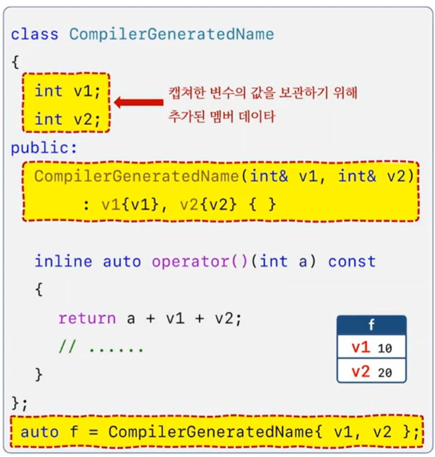
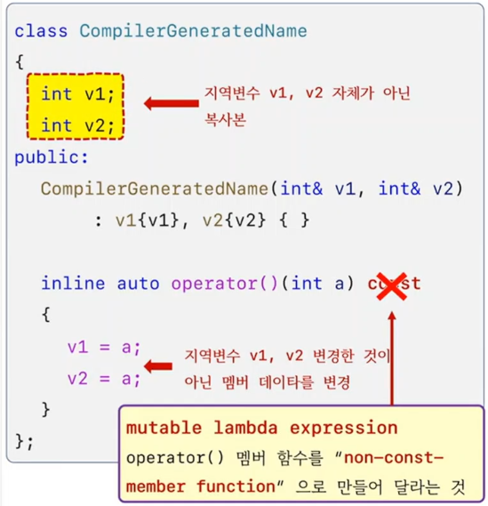
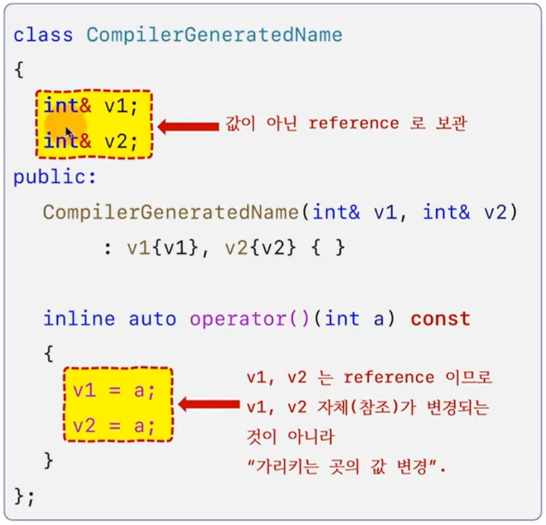

```c++
#include <iostream>

int main()
{
	int v1 = 10, v2 = 20;


	auto f = [v1, v2](int a) { return a + v1 + v2;};
			 // CompilerGeneratedName {v1, v2};

	std::cout << f(5) << std::endl; // 35

	std::cout << sizeof(f) << std::endl; //8 

}
```



```c++
#include <iostream>

int main()
{
	int v1 = 10, v2 = 20;


//	auto f = [v1, v2](int a) { v1 = a; v2 = a;};
	auto f = [v1, v2](int a) mutable { v1 = a; v2 = a;};


	f(3);


	std::cout << v1 << std::endl; // 10
	std::cout << v2 << std::endl; // 20
}
```


```c++
#include <iostream>

int main()
{
	int v1 = 10, v2 = 20;


//	auto f = [v1, v2](int a)         { v1 = a; v2 = a;}; // error
//	auto f = [v1, v2](int a) mutable { v1 = a; v2 = a;}; // ok. 복사본 변경

	auto f = [&v1, &v2](int a) { v1 = a; v2 = a;};

	f(3);


	std::cout << v1 << std::endl; // 3
	std::cout << v2 << std::endl; // 3
}
```




```c++
#include <string>
#include <iostream>

int main()
{
	int v1 = 10, v2 = 10;

	auto f1 = [v1, &v2]() {};

	auto f2 = [=]() {}; 
	auto f3 = [&]() {};

	auto f4 = [=, &v1]() {};
	auto f5 = [&,  v1]() {};
//	auto f6 = [&, &v1]() {}; // error

	auto f7 = [x = v1, &y = v2](int a) { y = a + x; };

	std::string s = "hello";

	auto f8 = [ msg = std::move(s) ]() {};

	std::cout << s << std::endl;
}
```

## default capture
1) [=] : 모든 지역 변수를 capture by value
2) [&] : 모든 지역 변수를 capture by reference

